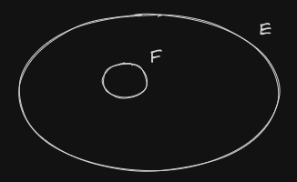
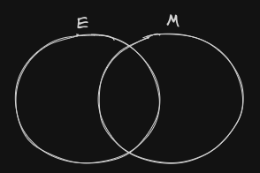

Date: 2023-06-05

### Logical Connectives
1. Negation (NOT) $\neg$
2. Cojuction (AND) $\land$
3. Disjunction (OR) $\vee$ 
4. Implication (implies) $\rightarrow$
5. Biconditional (if and only if) $\leftrightarrow$

### Syllogism

> [Google](https://duckduckgo.com/?q=syllogism&t=brave&ia=definition):
A form of deductive reasoning consisting of a major premise, a minor 
premise, and a conclusion. 

> [Wikipedia](https://en.wikipedia.org/wiki/Syllogism): a kind of logical
argument that applies deductive reasoning to arrive at a conclusion based 
on two propositions that are asserted or assumed to be true.

Examples:

- All men are mortals. Socrates is a man. So, Socrates is moral
- Dogs have feathers. No feathered creature eats pasta. So, dogs do not eat pasta.

### Euler Diagrams

> [Wikipedia](https://en.wikipedia.org/wiki/Euler_diagram): is a diagrammatic means of 
representing sets and their relationships. They are particularly useful for explaining 
complex hierarchies and overlapping definitions. They are similar to another set diagramming 
technique, Venn diagrams. Unlike Venn diagrams, which show all possible relations between different 
sets, the Euler diagram shows only relevant relationships.

Examples:

All fish live in water. Tuna is a fish. So, Tuna lives in water.

- Let E: All fish live in water. 
- Let F: Tuna is a fish

There are mammals that live in water. Dolphins are mammals. So, dolphins live in water.

- Let E: animals that live in water
- Let M: mammals

